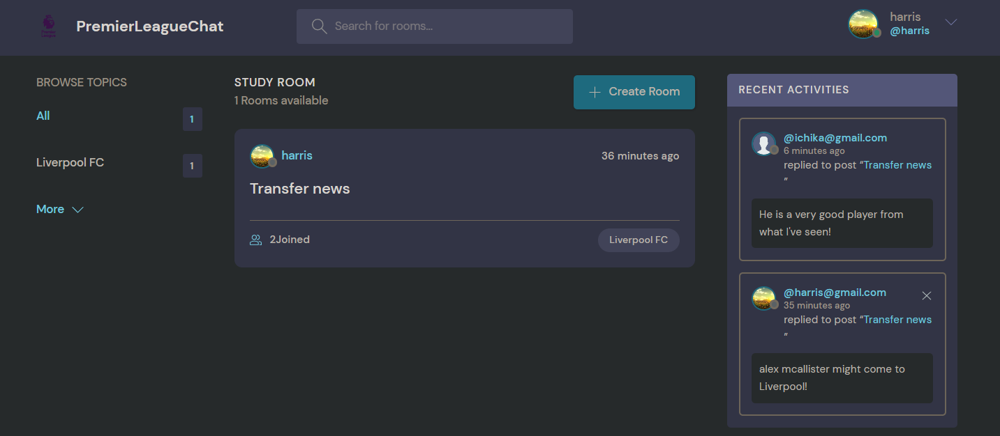
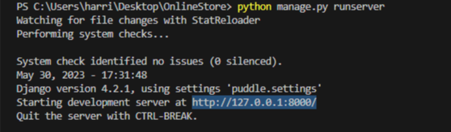

# PremierLeagueChat

<h2>What is PremierLeagueChat?</h2>

PremierLeagueChat is an online social media platform wherein avid fans of premier football take part in discussions regarding the biggest news within the world of football. This platform lets users to register and login into thematic chat rooms tailored to their individual interests. Users can also customize profile picture, bios, and username and create new topics and chat rooms to invite other football fans to talk about the lastest news. Additionally, a live feed showcasing the most recent conversations within chat rooms is  featured on the application's homepage, allowing users the opportunity to see and join into the conversation. 

 

<h2>Techincal Overview:</h2>

PremierLeagueChat is a web application developed using Python, HTML/CSS, and the Django framework. By using HTML/CSS, users interact with clean and easy navigation throughout the application. Using the MVT (Model-View-Template) pattern with Python and SQLite, backend logic and database management are handled efficiently. Moreover, the Django REST framework is used to facilitate the development of a web API that enables third party accessibility.

<h2>How to Run on local computer:</h2>

  -Clone this repository.

  -Set up Django, tutorial: (https://www.youtube.com/watch?v=MLeVezRSjvU)

  -In termainal, change directory to project. Then type "python manage.py runserver" to start the server on local computer.

  -After starting the server, paste the following into web browser url to run the web application.

  
  

